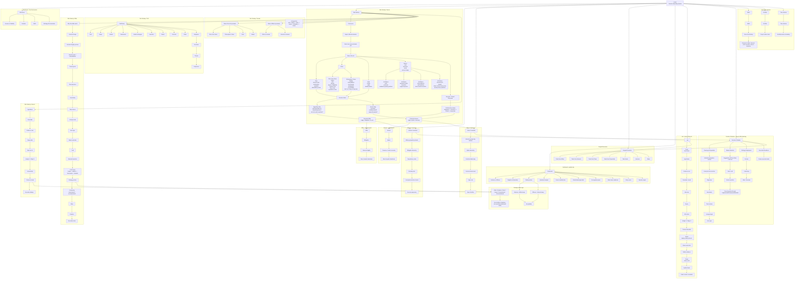

```mermaid
flowchart TD
    A["KHAL<br/>Decision Operating System"] --> B["War Room"]
    A --> C["War Gaming"]
    A --> D["Mission Command"]
    A --> E["Vision Command"]
    A --> F["Surgical Execution"]
    A --> G["Dashboard"]
    A --> H["Lab"]
    A --> I["Decision Chamber"]
    A --> J["Drafts"]
    A --> K["Portfolio"]
    A --> L["Time Horizon"]

    subgraph WarRoom["War Room = See the decision"]
        B --> B1["Sources of Volatility"]
        B --> B2["Domains"]
        B --> B3["Crafts"]
        B --> B4["Ontology-first orientation"]
    end

    subgraph SourceChamber["War Gaming / Source"]
        C --> S1["Pick source"]
        S1 --> S2["Inspect affected domains"]
        S2 --> S3["Select one source-domain pair"]
        S3 --> SOA["State of the Art"]

        SOA --> MAP["Map<br/>decision type<br/>tail behavior<br/>quadrant<br/>admissible posture"]
        SOA --> STONE["Stone"]
        STONE --> SIG["Skin in the Game<br/>stakes<br/>risks<br/>lineage<br/>players / fragilistas<br/>capital at risk<br/>time at risk<br/>reputation at risk"]
        STONE --> PST["Philosopher's Stone<br/>fragility<br/>vulnerabilities<br/>non-linearity<br/>propagation<br/>irreversibility<br/>short vol / long vol exposure"]
        SOA --> ENDS["Ends<br/>hedge<br/>edge<br/>barbell posture"]
        SOA --> MEANS["Means<br/>craft<br/>heuristics<br/>avoid<br/>protocol shape"]

        MEANS --> Q1["Q1 Means<br/>rules<br/>protocols<br/>standard operating method"]
        MEANS --> Q2["Q2 Means<br/>bounded models<br/>heuristics<br/>capped exposure"]
        MEANS --> Q3["Q3 Means<br/>local judgment<br/>craft selection<br/>stress-tested heuristics"]
        MEANS --> Q4["Q4 Means<br/>heuristic-first<br/>barbell<br/>tinker / limited intervention<br/>avoid precise prediction"]

        MAP --> GATES["Decision Gates"]
        PST --> GATES
        ENDS --> GATES

        GATES --> ERG["Ergodicity Gate<br/>path dependence?<br/>absorbing barrier?<br/>ruin risk under repetition?"]
        GATES --> JEN["Jensen Gate<br/>convexity?<br/>volatility benefit?<br/>capped downside?"]

        SOA --> STR["Scenario / Threat / Response"]
        STR --> CHAINS["Craft doctrine chains<br/>wargames -> scenarios -> threats -> responses"]

        ERG --> AFFGEN["Generate Affair<br/>hedge / obligation / no-ruin"]
        JEN --> INTGEN["Generate Interest<br/>edge / option / convexity"]
        CHAINS --> AFFGEN
        CHAINS --> INTGEN
    end

    subgraph DomainChamber["War Gaming / Domain"]
        C --> DC1["State of the Art by domain"]
        DC1 --> DC2["Skin in the Game"]
        DC1 --> DC3["Philosopher's Stone"]
        DC1 --> DC4["Ends"]
        DC1 --> DC5["Means"]
        C --> DC6["State of Affairs by domain"]
        DC6 --> DC7["Affairs in domain"]
        DC6 --> DC8["Interests in domain"]
        C --> DC9["Lineage lens<br/>self -> family -> state -> nation -> humanity -> nature"]
    end

    subgraph CraftChamber["War Gaming / Craft"]
        C --> CR1["Craft library"]
        CR1 --> CR2["Craft"]
        CR1 --> CR3["Heaps"]
        CR1 --> CR4["Models"]
        CR1 --> CR5["Frameworks"]
        CR1 --> CR6["Barbell strategies"]
        CR1 --> CR7["Heuristics"]
        CR1 --> CR8["Stacks"]
        CR1 --> CR9["Protocols"]
        CR1 --> CR10["Rules"]
        CR1 --> CR11["Wargames"]
        CR11 --> CR12["Scenarios"]
        CR12 --> CR13["Threats"]
        CR13 --> CR14["Responses"]
    end

    subgraph AffairsState["Affair = hedge branch"]
        AFFGEN --> A1["Affair"]
        A1 --> A2["Obligation"]
        A2 --> A3["Remove fragility"]
        A3 --> A4["Move toward robustness"]
    end

    subgraph InterestsState["Interest = edge branch"]
        INTGEN --> I1["Interest"]
        I1 --> I2["Option"]
        I2 --> I3["Preserve / create convexity"]
        I3 --> I4["Move beyond robustness"]
    end

    subgraph AffairChamber["War Gaming / Affair"]
        C --> WA1["Why this affair exists"]
        WA1 --> WA2["Inherited hedge"]
        WA2 --> WA3["Inherited fragility posture"]
        WA3 --> WA4["Inherited risks / vulnerabilities"]
        WA4 --> WA5["Planning lens"]
        WA5 --> WA6["Plan objectives"]
        WA6 --> WA7["Uncertainty"]
        WA7 --> WA8["Time horizon"]
        WA8 --> WA9["Lineage node"]
        WA9 --> WA10["Actor type"]
        WA10 --> WA11["Means selection"]
        WA11 --> WA12["Craft"]
        WA12 --> WA13["Selected heuristics"]
        WA13 --> WA14["Craft traces<br/>heaps -> models -> frameworks -> barbells"]
        WA14 --> WA15["Strategy posture"]
        WA15 --> WA16["Positioning<br/>conventional / unconventional"]
        WA16 --> WA17["Allies"]
        WA17 --> WA18["Enemies"]
        WA18 --> WA19["Execution tasks"]
    end

    subgraph DecisionChamberFlow["Decision Chamber = deeper affair planning"]
        I --> P1["Planning & Preparation"]
        P1 --> P2["Inherited preparation context"]
        P2 --> P3["Seed plan from doctrine"]
        P3 --> P4["Objectives"]
        P4 --> P5["Uncertainty"]
        P5 --> P6["Time horizon"]
        P6 --> P7["Lineage target"]
        P7 --> P8["Actor type"]
        I --> MNS1["Means Selection"]
        MNS1 --> MNS2["Suggested craft from State of the Art"]
        MNS2 --> MNS3["Select craft"]
        MNS3 --> MNS4["Select heuristics"]
        MNS4 --> MNS5["Trace heuristics through heaps/models/frameworks/barbells"]
        I --> STRAT1["Strategy Deployment"]
        STRAT1 --> STRAT2["Posture"]
        STRAT2 --> STRAT3["Positioning"]
        STRAT3 --> STRAT4["Allies / Enemies"]
        I --> EXE1["Execution Readiness"]
        EXE1 --> EXE2["Create execution tasks"]
    end

    subgraph InterestChamber["War Gaming / Interest"]
        C --> WI1["Hypothesis"]
        WI1 --> WI2["Downside"]
        WI2 --> WI3["Evidence note"]
        WI3 --> WI4["Expiry date"]
        WI4 --> WI5["Max loss %"]
        WI5 --> WI6["Hedge % / Edge %"]
        WI6 --> WI7["Irreversibility"]
        WI7 --> WI8["Protocol checks"]
        WI8 --> WI9["Execution linkage"]
    end

    subgraph LabFlow["Lab = interest lifecycle"]
        H --> LF1["Forge<br/>form thesis"]
        LF1 --> LF2["Hypothesis"]
        LF2 --> LF3["Evidence note"]
        LF3 --> LF4["Downside / avoid"]
        LF4 --> LF5["Max loss"]
        LF5 --> LF6["Expiry"]
        LF6 --> LF7["Kill criteria"]
        LF7 --> LF8["Hedge % / Edge %"]
        LF8 --> LF9["Protocol checklist"]
        LF9 --> LW1["Wield<br/>deploy under protocol"]
        LW1 --> LW2["Queue execution"]
        LW2 --> LW3["Gather evidence"]
        LW3 --> LT1["Tinker<br/>refine or kill"]
        LT1 --> LT2["Update thesis"]
        LT2 --> LT3["Scale / revise / terminate"]
    end

    subgraph MissionFlow["Mission Command"]
        D --> M1["Affairs grouped by domain"]
        M1 --> M2["Obligation hierarchy"]
        M2 --> M3["Dependency order"]
        M3 --> M4["Blocking risks"]
        M4 --> M5["Incomplete doctrine checks"]
        M5 --> M6["No-ruin sequencing"]
    end

    subgraph VisionFlow["Vision Command"]
        E --> V1["Interests grouped by domain"]
        V1 --> V2["Option hierarchy"]
        V2 --> V3["Doctrine-linked edge"]
        V3 --> V4["Doctrine-linked avoid"]
        V4 --> V5["Open Lab"]
        V5 --> V6["Open Portfolio"]
    end

    subgraph ExecutionFlow["Surgical Execution"]
        F --> X1["Tasks from Affairs"]
        F --> X2["Tasks from Interests"]
        F --> X3["Tasks from Plans"]
        F --> X4["Tasks from Preparation"]
        F --> X5["Task chains"]
        F --> X6["Horizons"]
        F --> X7["Status"]
    end

    subgraph DashboardFlow["Dashboard = global only"]
        G --> G1["Defense vs Offense"]
        G --> G2["Fragility vs Optionality"]
        G --> G3["Global posture"]
        G --> G4["Quadrant heatgrid"]
        G --> G5["Source volatility flow"]
        G --> G6["Global barbell guardrail"]
        G --> G7["Via negativa queue"]
        G --> G8["Black swan readiness"]
        G --> G9["Entry routes"]
        G --> G10["Operator signal"]
    end

    subgraph StrategicMatrix["Strategic matrix logic"]
        G3 --> SM1["Defense = Affair-heavy"]
        G3 --> SM2["Offense = Interest-heavy"]
        SM1 --> SM3["Use globally"]
        SM2 --> SM3
        WA15 --> SM4["Allies / Enemies / Overt / Covert / Conventional / Unconventional"]
        WI8 --> SM4
        SM4 --> SM5["Use locally in chambers, not as primary dashboard clutter"]
    end

    subgraph SupportingSystems["Supporting systems"]
        J --> J1["Drafts"]
        J1 --> J2["Prose-first thinking"]
        J2 --> J3["Promote to affair / interest / craft / scenario / threat / response"]
        K --> K1["Portfolio"]
        K1 --> K2["Projects above bets"]
        L --> L1["Time Horizon"]
        L1 --> L2["Mortality-aware scheduling"]
    end

    AFFGEN --> D
    INTGEN --> E
    D --> I
    E --> H
    I --> F
    H --> F
```
