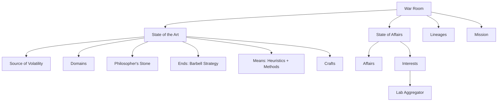
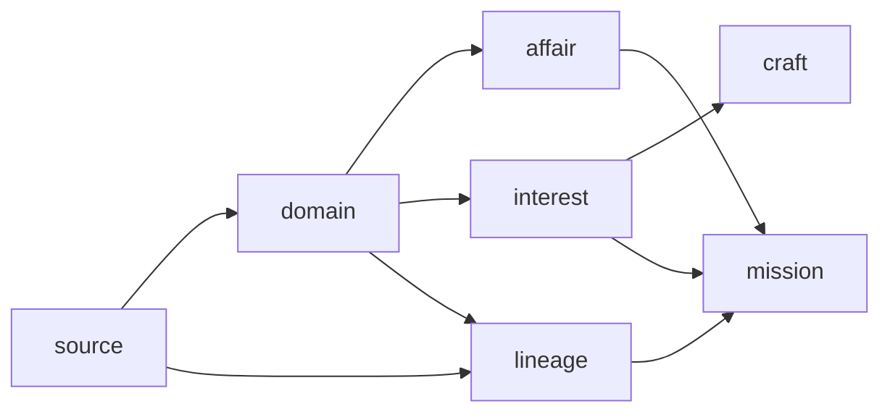
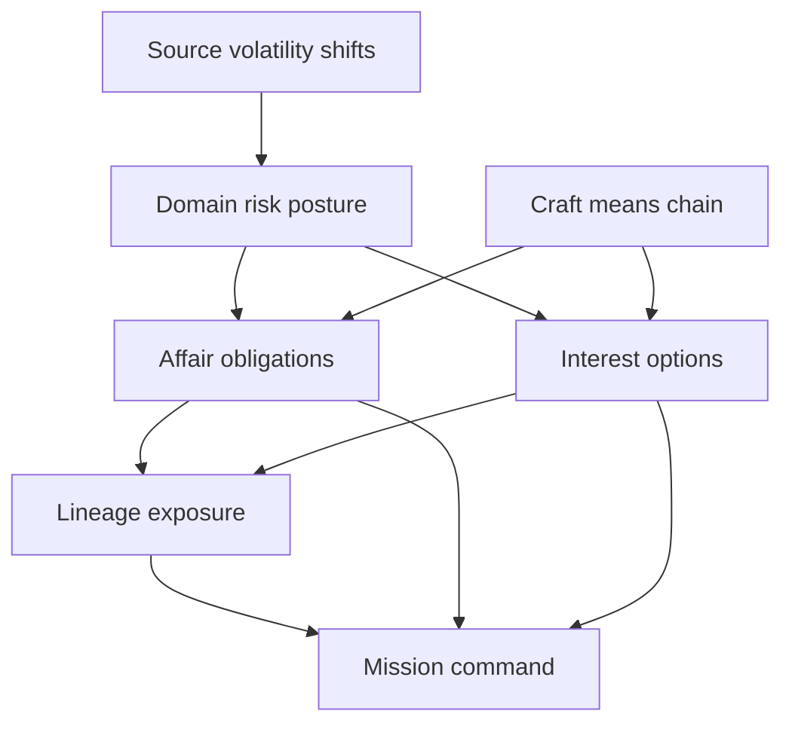

# War Room Fractal Decision Tree (v0.4.2)

This artifact defines macro hierarchy, path dependency, and interdependence overlay for War Gaming.

## 1) Macro Hierarchy

## 2) Path Dependency (War Gaming Modes)

## 3) Interdependence Overlay

## 4) Mode-Specific Grammar Registry

1. `source`
- profile, linked domains, propagation path, uncertainty band.
2. `domain`
- class, stakes, risk map, fragility/vulnerability, ends/means posture.
3. `affair`
- obligation objective, ORK/KPI, preparation, thresholds, execution chain.
4. `interest`
- forge/wield/tinker, hypothesis, max-loss + expiry, kill criteria, barbell split, evidence.
5. `craft`
- heap set, model extraction, framework assembly, barbell output, heuristic output.
6. `lineage`
- exposure map, stake scaling, blast radius, intergenerational risk.
7. `mission`
- hierarchy, dependency chain, readiness, no-ruin constraints.

## 5) Hybrid Role Policy

1. `Missionary`
- dependency-first posture.
- risky actions blocked when predecessor modes or required grammar fields are incomplete.
2. `Visionary`
- mode jumping allowed.
- dependency misses shown as warnings; grammar misses still block risky execution actions.

