# Khal_genesis

## Canonical status
This file is the canonical product doctrine reference for KHAL.

Use this as the single source of truth for:
- product structure
- doctrine structure
- UI/UX surface intent
- end-to-end entity flow
- quadrant-sensitive means logic
- Affairs / Interests branching logic
- Drafts, Lab, Campaign, Portfolio, and Execution relationships

This file does **not** replace runtime authority.

Runtime authority remains:
- SQLite: `data/KHAL.sqlite`
- Excel: `Genesis.xlsx` is archival/reference only

## Core doctrine
KHAL is a decision operating system.

It exists to:
- classify volatility
- understand consequence structure
- reduce fragility
- preserve convex optionality
- turn judgment into hierarchy, plans, and task chains

### Product spine
- `War Room` = see the decision
- `War Gaming` = game the decision
- `Mission Command` = organize affairs
- `Vision Command` = organize interests
- `Surgical Execution` = execute task chains
- `Dashboard` = global system telemetry

### Two-layer ontology
#### 1. State of the Art
The world as it is.

- `Map`
  - decision type
  - tail behavior
  - quadrant
  - admissible posture
- `Stone`
  - `Skin in the Game`
    - stakes
    - risks
    - lineage
    - players / fragilistas
    - capital at risk
    - time at risk
    - reputation at risk
  - `Philosopher's Stone`
    - fragility
    - vulnerabilities
    - non-linearity
    - propagation
    - irreversibility
    - short volatility / long volatility exposure
- `Ends`
  - hedge
  - edge
  - barbell posture
- `Means`
  - craft
  - heuristics
  - avoid
  - protocols
  - rules
  - doctrine-chain shape

#### 2. State of Affairs
What follows from the world as it is.

- `Affairs`
  - obligations
  - hedge-dominant
  - remove fragility
  - move toward robustness
- `Interests`
  - options
  - edge-dominant
  - preserve or create convex payoff
  - move beyond robustness

## Unified branch logic
KHAL should be understood through two explicit decision gates:

### Ergodicity Gate
Question:
- if this exposure is repeated through time, does ruin compound faster than averages suggest?
- is there path dependence, an absorbing barrier, or irreversible downside?

If yes:
- generate or prioritize `Affair`
- treat as hedge / obligation / no-ruin branch

### Jensen Gate
Question:
- does volatility improve payoff because the response is convex?
- can downside be capped while preserving nonlinear upside?

If yes:
- generate or prioritize `Interest`
- treat as edge / option / convexity branch

## Means doctrine
`Means` is not fixed.

It changes as a function of:
- quadrant
- domain
- source
- stakes
- irreversibility

### Quadrant-sensitive means
#### Q1
Use:
- rules
- protocols
- standard operating methods
- direct execution logic

#### Q2
Use:
- bounded models
- heuristics
- capped exposure
- measured optimization

#### Q3
Use:
- local judgment
- craft selection
- stress-tested heuristics
- skepticism toward abstract optimization

#### Q4
Use:
- no-ruin first
- heuristic-first
- barbell posture
- tinker / probe / limited intervention
- optionality
- avoidance of prediction-heavy methods

So:
- `Means` changes by quadrant
- and also changes by domain inside the same quadrant

Example:
- `Q4 + Capital Structure` does not use the same craft as
- `Q4 + Health`

## Major objects
- volatility sources
- domains
- source-map profiles
- affairs
- interests
- crafts
- heaps
- models
- frameworks
- barbell strategies
- heuristics
- stacks
- protocols
- rules
- wargames
- scenarios
- threats
- responses
- lineages
- lineage entities
- lineage risks
- mission graph
- plans
- preparation
- tasks
- drafts
- structural anchors
- promotion events
- portfolio projects
- portfolio experiments
- portfolio evidence
- portfolio decision gates
- portfolio ship logs
- campaign snapshots
- time horizon profile

## Surface contracts
### War Room
Function:
- authoritative ontology

Shows:
- sources of volatility
- domains
- crafts

Answers:
- what forces are active
- where they land
- what means exist

### War Gaming / Source
Function:
- transform a volatility source into a domain-specific posture

Flow:
1. pick source
2. inspect affected domains
3. select source-domain pair
4. work through `Map`
5. work through `Stone`
6. define `Ends`
7. define `Means`
8. pressure-test with `Scenario / Threat / Response`
9. apply `Ergodicity Gate`
10. apply `Jensen Gate`
11. generate `Affair` and/or `Interest`

### War Gaming / Domain
Function:
- inspect one domain through State of the Art and State of Affairs

### War Gaming / Craft
Function:
- inspect admissible methods and doctrine assets

Shows:
- craft
- heaps
- models
- frameworks
- barbell strategies
- heuristics
- stacks
- protocols
- rules
- wargames
- scenarios
- threats
- responses

### War Gaming / Affair
Function:
- planning lens for one obligation

Must include:
- inherited hedge
- inherited fragility posture
- inherited risks / vulnerabilities
- planning & preparation
- objectives
- uncertainty
- time horizon
- lineage target
- actor type
- means selection
- craft
- heuristics
- craft traces through heaps/models/frameworks/barbells
- posture
- positioning
- allies
- enemies
- execution tasks

### Decision Chamber
Function:
- deeper affair-centric protocol and plan surface

Must include:
- inherited preparation context
- seed plan from doctrine
- save plan
- save means
- create execution tasks

### War Gaming / Interest
Function:
- planning lens for one option

Must include:
- hypothesis
- downside
- evidence note
- expiry
- max loss
- hedge %
- edge %
- irreversibility
- protocol readiness
- linked execution

### Mission Command
Function:
- organize affairs

Shows:
- obligation hierarchy
- dependency order
- blocking risks
- incomplete doctrine checks
- no-ruin sequence

### Vision Command
Function:
- organize interests

Shows:
- option hierarchy
- doctrine-linked edge
- doctrine-linked avoid
- links to Lab
- links to Portfolio

### Lab
Function:
- lifecycle for interests

Stages:
- `Forge`
  - form thesis
- `Wield`
  - deploy under protocol
- `Tinker`
  - refine or kill from evidence

### Campaign
Function:
- repeated execution pattern attached to an Interest, optionally associated with an Affair

Current logic shape:
- a campaign is detected from an `INTEREST` task root whose title starts with `Campaign:`
- child tasks are treated as attempts
- the system measures:
  - attempt count
  - active count
  - converged count
  - conversion percentage
  - fragility band

Doctrine:
- Campaign belongs below Interest and Execution
- Campaign is not Portfolio
- Campaign is how an option is operationally probed across multiple attempts

### Portfolio War Room
Function:
- command layer above bets

Portfolio is:
- not a duplicate of Interests
- not a task manager
- not a project tracker

Portfolio is:
- command over multiple bets
- above options
- where projects, evidence, gates, experiments, and ship logs are commanded together

### Surgical Execution
Function:
- task-chain layer

Tasks can come from:
- Affairs
- Interests
- Plans
- Preparation
- Campaign attempts

### Dashboard
Function:
- global telemetry only

Should show:
- defense vs offense
- fragility vs optionality
- global posture
- quadrant heatgrid
- source volatility flow
- barbell guardrail
- black swan readiness
- via negativa queue
- entry routes

Should **not** be the primary home for:
- local doctrine
- allies / enemies
- overt / covert posture

Those belong inside local chambers.

## Drafts doctrine
Drafts is the prose-first structural thinking surface.

It bridges:
- raw thought
- human-readable structure
- canonical promotion

Drafts supports:
- prose
- fragments
- scenario thoughts
- directives
- judgments

Drafts creates or suggests:
- affairs
- interests
- craft
- stack
- rule
- heuristic
- scenario
- threat
- response

Drafts is upstream of promotion, not downstream of forms.

## Strategic matrix doctrine
These concepts are real, but they should not all live at dashboard level.

### Global level
Use:
- defense
- offense
- fragility
- optionality

### Local chamber level
Use:
- allies
- enemies
- overt
- covert
- conventional
- unconventional

That means:
- `Dashboard` keeps the macro split
- `Affair` and `Interest` chambers keep the contextual posture fields

## Canonical end-to-end mermaid

```mermaid
flowchart TD
    A["KHAL<br/>Decision Operating System"] --> B["War Room"]
    A --> C["War Gaming"]
    A --> D["Mission Command"]
    A --> E["Vision Command"]
    A --> F["Surgical Execution"]
    A --> G["Dashboard"]
    A --> H["Lab"]
    A --> I["Decision Chamber"]
    A --> J["Drafts"]
    A --> K["Portfolio War Room"]
    A --> L["Time Horizon"]

    subgraph WR["War Room = See the decision"]
        B --> B1["Sources of Volatility"]
        B --> B2["Domains"]
        B --> B3["Crafts"]
    end

    subgraph SRC["War Gaming / Source"]
        C --> S1["Pick source"]
        S1 --> S2["Affected domains"]
        S2 --> S3["Select source-domain pair"]
        S3 --> SOA["State of the Art"]

        SOA --> MAP["Map<br/>decision type<br/>tail behavior<br/>quadrant<br/>admissible posture"]
        SOA --> STONE["Stone"]
        STONE --> SIG["Skin in the Game<br/>stakes<br/>risks<br/>lineage<br/>players / fragilistas<br/>capital / time / reputation at risk"]
        STONE --> PST["Philosopher's Stone<br/>fragility<br/>vulnerabilities<br/>non-linearity<br/>propagation<br/>irreversibility<br/>short vol / long vol"]
        SOA --> ENDS["Ends<br/>hedge<br/>edge<br/>barbell posture"]
        SOA --> MEANS["Means<br/>craft<br/>heuristics<br/>avoid<br/>protocol shape"]

        MEANS --> MQ1["Q1 means<br/>rules<br/>protocols"]
        MEANS --> MQ2["Q2 means<br/>bounded models<br/>heuristics"]
        MEANS --> MQ3["Q3 means<br/>local judgment<br/>craft"]
        MEANS --> MQ4["Q4 means<br/>heuristic-first<br/>barbell<br/>tinker / probe"]

        MAP --> GATE["Decision Gates"]
        PST --> GATE
        ENDS --> GATE

        GATE --> ERG["Ergodicity Gate<br/>ruin under repetition?<br/>path dependence?<br/>absorbing barrier?"]
        GATE --> JEN["Jensen Gate<br/>convexity?<br/>volatility benefit?<br/>capped downside?"]

        SOA --> STR["Scenario / Threat / Response"]
        STR --> CHAINS["Doctrine chains<br/>wargames -> scenarios -> threats -> responses"]

        ERG --> AFFGEN["Generate Affair<br/>hedge / obligation / no-ruin"]
        JEN --> INTGEN["Generate Interest<br/>edge / option / convexity"]
        CHAINS --> AFFGEN
        CHAINS --> INTGEN
    end

    subgraph DOM["War Gaming / Domain"]
        C --> D1["State of the Art by domain"]
        D1 --> D2["Skin in the Game"]
        D1 --> D3["Philosopher's Stone"]
        D1 --> D4["Ends"]
        D1 --> D5["Means"]
        C --> D6["State of Affairs by domain"]
        D6 --> D7["Affairs in domain"]
        D6 --> D8["Interests in domain"]
        C --> D9["Lineage lens"]
    end

    subgraph CRAFT["War Gaming / Craft"]
        C --> CR1["Craft"]
        CR1 --> CR2["Heaps"]
        CR1 --> CR3["Models"]
        CR1 --> CR4["Frameworks"]
        CR1 --> CR5["Barbell strategies"]
        CR1 --> CR6["Heuristics"]
        CR1 --> CR7["Stacks"]
        CR1 --> CR8["Protocols"]
        CR1 --> CR9["Rules"]
        CR1 --> CR10["Wargames"]
        CR10 --> CR11["Scenarios"]
        CR11 --> CR12["Threats"]
        CR12 --> CR13["Responses"]
    end

    subgraph AFF["Affair = hedge branch"]
        AFFGEN --> A1["Affair"]
        A1 --> A2["Obligation"]
        A2 --> A3["Remove fragility"]
        A3 --> A4["Toward robustness"]
    end

    subgraph WGA["War Gaming / Affair"]
        C --> WA1["Inherited hedge"]
        WA1 --> WA2["Inherited fragility posture"]
        WA2 --> WA3["Inherited risks / vulnerabilities"]
        WA3 --> WA4["Planning & preparation"]
        WA4 --> WA5["Objectives"]
        WA5 --> WA6["Uncertainty"]
        WA6 --> WA7["Time horizon"]
        WA7 --> WA8["Lineage target"]
        WA8 --> WA9["Actor type"]
        WA9 --> WA10["Means selection"]
        WA10 --> WA11["Craft"]
        WA11 --> WA12["Selected heuristics"]
        WA12 --> WA13["Craft traces<br/>heaps -> models -> frameworks -> barbells"]
        WA13 --> WA14["Posture / positioning"]
        WA14 --> WA15["Allies / enemies"]
        WA15 --> WA16["Execution tasks"]
    end

    subgraph DEC["Decision Chamber"]
        D --> I
        I --> P1["Planning & Preparation"]
        P1 --> P2["Inherited preparation context"]
        P2 --> P3["Seed plan from doctrine"]
        P3 --> P4["Save plan"]
        I --> M1["Means Selection"]
        M1 --> M2["Suggested craft"]
        M2 --> M3["Select heuristics"]
        M3 --> M4["Trace means through knowledge ladder"]
        I --> S1B["Strategy Deployment"]
        S1B --> S2B["Posture"]
        S2B --> S3B["Positioning"]
        S3B --> S4B["Allies / Enemies"]
        I --> E1B["Execution Readiness"]
        E1B --> E2B["Create execution tasks"]
    end

    subgraph INT["Interest = edge branch"]
        INTGEN --> I1["Interest"]
        I1 --> I2["Option"]
        I2 --> I3["Convex payoff"]
        I3 --> I4["Beyond robustness"]
    end

    subgraph WGI["War Gaming / Interest"]
        C --> WI1["Hypothesis"]
        WI1 --> WI2["Downside"]
        WI2 --> WI3["Evidence note"]
        WI3 --> WI4["Expiry"]
        WI4 --> WI5["Max loss"]
        WI5 --> WI6["Hedge % / Edge %"]
        WI6 --> WI7["Irreversibility"]
        WI7 --> WI8["Protocol readiness"]
    end

    subgraph VSN["Vision Command"]
        E --> V1["Interests grouped by domain"]
        V1 --> V2["Option hierarchy"]
        V2 --> V3["Doctrine-linked edge"]
        V3 --> V4["Doctrine-linked avoid"]
        V4 --> V5["Open Lab"]
        V5 --> V6["Open Portfolio"]
    end

    subgraph LAB["Lab"]
        H --> LF1["Forge<br/>form thesis"]
        LF1 --> LF2["Hypothesis"]
        LF2 --> LF3["Evidence note"]
        LF3 --> LF4["Downside / avoid"]
        LF4 --> LF5["Max loss"]
        LF5 --> LF6["Expiry"]
        LF6 --> LF7["Kill criteria"]
        LF7 --> LF8["Hedge % / Edge %"]
        LF8 --> LF9["Protocol checklist"]
        LF9 --> LW1["Wield<br/>deploy under protocol"]
        LW1 --> LW2["Queue execution"]
        LW2 --> LW3["Gather evidence"]
        LW3 --> LT1["Tinker<br/>refine or kill"]
        LT1 --> LT2["Scale / revise / terminate"]
    end

    subgraph CAM["Campaign"]
        H --> CPG1["Campaign root from Interest"]
        CPG1 --> CPG2["Parallel attempts"]
        CPG2 --> CPG3["Attempt count"]
        CPG3 --> CPG4["Converged count"]
        CPG4 --> CPG5["Conversion %"]
        CPG5 --> CPG6["Fragility band"]
    end

    subgraph MIS["Mission Command"]
        D --> MC1["Affairs grouped by domain"]
        MC1 --> MC2["Hierarchy"]
        MC2 --> MC3["Dependencies"]
        MC3 --> MC4["Blocking risks"]
        MC4 --> MC5["Incomplete doctrine checks"]
        MC5 --> MC6["No-ruin sequencing"]
    end

    subgraph POR["Portfolio War Room"]
        K --> PK1["Projects above bets"]
        PK1 --> PK2["Strategic role"]
        PK2 --> PK3["Stage"]
        PK3 --> PK4["Signal band"]
        PK4 --> PK5["Bottleneck"]
        PK5 --> PK6["Experiment"]
        PK6 --> PK7["Evidence"]
        PK7 --> PK8["Decision gate"]
        PK8 --> PK9["Ship log"]
    end

    subgraph EXE["Surgical Execution"]
        F --> X1["Tasks from Affairs"]
        F --> X2["Tasks from Interests"]
        F --> X3["Tasks from Plans"]
        F --> X4["Tasks from Preparation"]
        F --> X5["Tasks from Campaign attempts"]
        F --> X6["Task chains"]
        F --> X7["Horizons"]
        F --> X8["Status"]
    end

    subgraph DRF["Drafts"]
        J --> J1["Raw prose"]
        J1 --> J2["Structural anchors"]
        J2 --> J3["Promotion events"]
        J3 --> J4["Promote to affair / interest / craft / scenario / threat / response"]
    end

    subgraph DSH["Dashboard = global only"]
        G --> G1["Defense vs Offense"]
        G --> G2["Fragility vs Optionality"]
        G --> G3["Global posture"]
        G --> G4["Quadrant heatgrid"]
        G --> G5["Source volatility flow"]
        G --> G6["Barbell guardrail"]
        G --> G7["Via negativa"]
        G --> G8["Black swan readiness"]
        G --> G9["Operator signal"]
        G --> G10["Entry routes"]
    end

    subgraph TH["Time Horizon"]
        L --> T1["Mortality-aware scheduling"]
        T1 --> T2["Deadlines"]
        T2 --> T3["Scheduled / unscheduled tasks"]
        T3 --> T4["Horizon placement"]
    end

    AFFGEN --> D
    INTGEN --> E
    E --> H
    E --> K
    H --> CAM
    I --> F
    H --> F
    CAM --> F
    J --> AFF
    J --> INT
```

## Operating interpretation
The whole product should be read in this order:

1. `War Room`
   See forces, domains, and means.
2. `War Gaming / Source`
   Classify the source-domain pair.
3. `State of the Art`
   Map, Stone, Ends, Means.
4. `Ergodicity Gate`
   If ruin compounds through time, generate `Affair`.
5. `Jensen Gate`
   If volatility benefits convex payoff, generate `Interest`.
6. `Mission Command`
   Order obligations.
7. `Vision Command`
   Order options.
8. `Lab`
   Form, deploy, and refine options.
9. `Campaign`
   Run repeated attempts under an interest.
10. `Portfolio`
   Command multiple bets above individual options.
11. `Surgical Execution`
   Execute tasks created from doctrine, plans, preparation, and campaigns.
12. `Dashboard`
   Read only global signal.

## UI / UX simplification rules
- one dominant purpose per surface
- Dashboard stays global
- local posture fields stay in chambers
- `Means` must be shown as adaptive, not static
- `Affair` must show planning and preparation explicitly
- `Interest` must show protocol and downside explicitly
- `Lab` is not generic experimentation; it is the controlled lifecycle of `Interest`
- `Campaign` is not Portfolio; it is repeated execution under an `Interest`
- `Portfolio` is above bets, not below them

